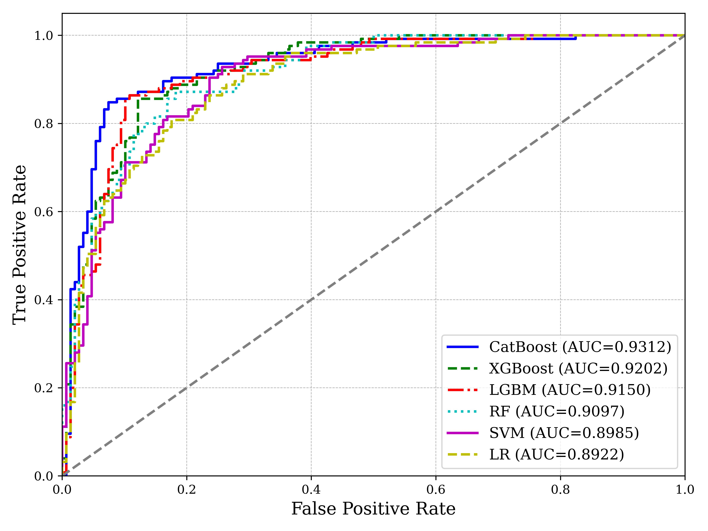
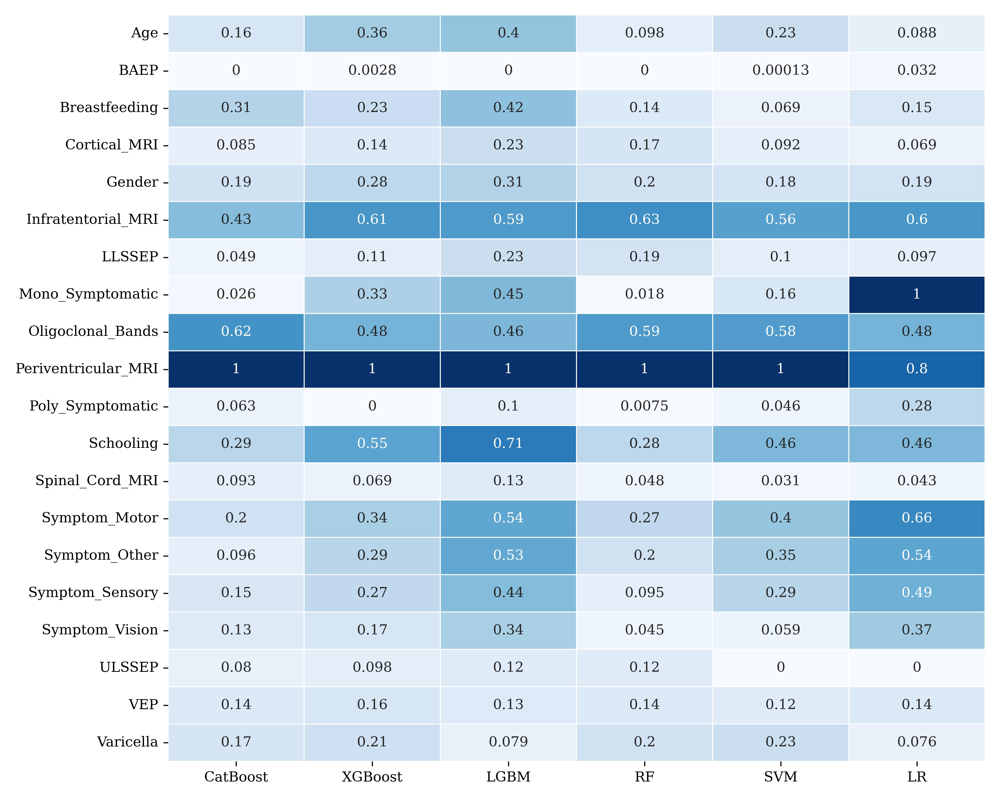

# Discovering Predictive Features of Multiple Sclerosis from Clinically Isolated Syndrome with Machine Learning

[](https://accscience.com/journal/AIH/1/4/10.36922/aih.4255)
[](https://doi.org/10.36922/aih.4255)
[](https://doi.org/10.17632/8wk5hjx7x2.1)
[](LICENSE)
[](Pipfile)

This is the official code, data splits, trained models and figures for the article:

> **Discovering predictive features of multiple sclerosis from clinically isolated syndrome with machine learning**
> Minh Sao Khue Luu, Bair N. Tuchinov, Anna I. Prokaeva, Denis S. Korobko, Nadezhda A. Malkova, Andrey A. Tulupov
> *Artificial Intelligence in Health*, 1(4), 107–122, 2024. [[Paper]](https://accscience.com/journal/AIH/1/4/10.36922/aih.4255) [[DOI]](https://doi.org/10.36922/aih.4255)


## Overview

Clinically isolated syndrome (CIS) is a first episode of neurological symptoms that can be the first sign of multiple sclerosis (MS). Not every CIS patient goes on to develop clinically definite MS (CDMS), so identifying high-risk patients early matters for treatment decisions.

This study:

1. **Classifies** CIS patients by whether they convert to MS, using six machine learning models: CatBoost, XGBoost, LightGBM, Random Forest, Support Vector Machine and Logistic Regression. Hyperparameters are tuned with Optuna and every model is evaluated with stratified 5-fold cross-validation.
2. **Compares** the models statistically using the Friedman test with Nemenyi post-hoc analysis, shown as a critical difference diagram.
3. **Explains** the predictions with SHAP values to find the most influential features, and with SHAP interaction values to show how pairs of features act together.

## Key Results

Mean performance across the five validation folds (from [notebooks/predict.ipynb](notebooks/predict.ipynb)):

| Model         | AUC        | Accuracy   | F1         | Precision  | Recall    | Specificity |
|---------------|-----------:|-----------:|-----------:|-----------:|----------:|------------:|
| **CatBoost**  | **0.9312** | **0.8791** | **0.8675** | **0.8710** | **0.864** | **0.8919**  |
| XGBoost       | 0.9202     | 0.8645     | 0.8514     | 0.8548     | 0.848     | 0.8784      |
| LightGBM      | 0.9150     | 0.8791     | 0.8675     | 0.8710     | 0.864     | 0.8919      |
| Random Forest | 0.9097     | 0.8388     | 0.8295     | 0.8045     | 0.856     | 0.8243      |
| SVM           | 0.8985     | 0.8168     | 0.8031     | 0.7907     | 0.816     | 0.8176      |
| Logistic Reg. | 0.8922     | 0.8132     | 0.7935     | 0.8033     | 0.784     | 0.8378      |

- **CatBoost** had the highest AUC (0.9312), with XGBoost second (0.9202).
- **Consistent predictors across models:** periventricular MRI lesions, infratentorial MRI lesions, oligoclonal bands, years of schooling and motor initial symptoms.
- **Feature interactions:** SHAP interaction analysis shows clinically meaningful pairs, for example oligoclonal bands × periventricular MRI and sensory × visual initial symptoms.

<p align="center">
  
  
</p>
<p align="center">
  
</p>

See [`img/`](img/) for all figures, including the confusion matrices, feature rankings and SHAP interaction plots.

## Dataset

The study uses the public dataset **"Conversion predictors of Clinically Isolated Syndrome to Multiple Sclerosis in Mexican patients: a prospective study"** (Pineda & Flores Rivera, Mendeley Data, [doi:10.17632/8wk5hjx7x2.1](https://doi.org/10.17632/8wk5hjx7x2.1)). It is a prospective cohort of **273 newly diagnosed CIS patients** at the National Institute of Neurology and Neurosurgery, Mexico City, followed from 2006 to 2010.

- **Features:** demographics (gender, age, schooling), history (breastfeeding, varicella), initial symptom, mono- or polysymptomatic onset, oligoclonal bands, evoked potentials (LLSSEP, ULSSEP, VEP, BAEP) and MRI lesion locations (periventricular, cortical, infratentorial, spinal cord).
- **Target:** `group`, conversion to CDMS (recoded so that 1 = MS and 0 = no MS).
- **Preprocessing:** `Initial_EDSS` and `Final_EDSS` are excluded. `Initial_Symptom` is one-hot encoded into vision, sensory, motor and other symptoms, and `Mono_or_Polysymptomatic` into two binary indicators.

A copy of the raw CSV and the fixed 5-fold stratified splits used in the paper are in [`data/`](data/), so the published results can be reproduced exactly.

## Repository Structure

```
CIStoCDMS/
├── data/
│   ├── conversion_predictors_of_..._multiple_sclerosis.csv   # raw dataset
│   ├── train/                  # X_train_fold{1-5}.csv, y_train_fold{1-5}.csv
│   └── val/                    # X_val_fold{1-5}.csv,   y_val_fold{1-5}.csv
├── notebooks/
│   ├── CB.ipynb                # CatBoost: tuning, 5-fold training, SHAP
│   ├── XGBoost.ipynb           # XGBoost
│   ├── LGBM.ipynb              # LightGBM
│   ├── RF.ipynb                # Random Forest
│   ├── SVM.ipynb               # Support Vector Machine
│   ├── LR.ipynb                # Logistic Regression
│   ├── predict.ipynb           # Table of evaluation metrics across folds
│   ├── statistical_test.ipynb  # Normality, Friedman and Nemenyi tests, CD diagram
│   └── explain.ipynb           # SHAP heatmaps, rankings, ROC, confusion matrices, interactions
├── results/
│   └── <model>/                # best_params.json, models/fold{1-5}.*, predictions, SHAP values
├── src/
│   ├── config.py               # Target column, random seed, model names
│   ├── paths.py                # Centralised file paths
│   ├── preprocessing.py        # Data loading and cleaning, fold handling
│   ├── trainer.py              # Cross-validation training and evaluation
│   ├── metrics.py              # AUC, accuracy, F1, precision, recall, specificity
│   ├── visualization.py        # Plotting utilities
│   └── helpers.py              # JSON, pickle and joblib I/O
├── img/                        # Figures used in the paper
├── Pipfile / Pipfile.lock      # Pinned environment
├── CITATION.cff
└── LICENSE
```

## Getting Started

### 1. Clone the repository

```bash
git clone https://github.com/luumsk/CIStoCDMS.git
cd CIStoCDMS
```

### 2. Set up the environment

The environment is pinned with [Pipenv](https://pipenv.pypa.io/):

```bash
pip install pipenv      # if Pipenv is not installed yet
pipenv install
pipenv shell
```

Main dependencies: `catboost 1.2.5`, `xgboost 2.0.3`, `lightgbm 4.4.0`, `scikit-learn 1.5.0`, `optuna 3.6.1`, `shap 0.45.1`, `scikit-posthocs`, `pandas 2.2.2` and `numpy 1.26.4`.

### 3. Run the notebooks

Start Jupyter from the repository root so that `src` can be imported:

```bash
jupyter notebook
```

To reproduce the paper, run the notebooks in this order:

1. **Train the models.** Run `CB`, `XGBoost`, `LGBM`, `RF`, `SVM` and `LR`. Each one tunes hyperparameters, trains on the five folds and saves its models, predictions and SHAP values to `results/<model>/`.
2. **Evaluate.** Run `predict.ipynb` for the metrics table.
3. **Compare statistically.** Run `statistical_test.ipynb` for the Friedman and Nemenyi tests and the critical difference diagram.
4. **Explain.** Run `explain.ipynb` for the SHAP analysis and all figures.

> **Tip:** Trained models and predictions are already in `results/`, so you can go straight to steps 2–4 without retraining.

## Citation

If you use this code or these results, please cite:

```bibtex
@article{luu2024discovering,
  title   = {Discovering predictive features of multiple sclerosis from clinically isolated syndrome with machine learning},
  author  = {Luu, Minh Sao Khue and Tuchinov, Bair N. and Prokaeva, Anna I. and Korobko, Denis S. and Malkova, Nadezhda A. and Tulupov, Andrey A.},
  journal = {Artificial Intelligence in Health},
  volume  = {1},
  number  = {4},
  pages   = {107--122},
  year    = {2024},
  doi     = {10.36922/aih.4255}
}
```

If you use the dataset, please also cite the original data source:

```bibtex
@misc{pineda_cis_ms_dataset,
  title     = {Conversion predictors of Clinically Isolated Syndrome to Multiple Sclerosis in Mexican patients: a prospective study},
  author    = {Pineda, Benjamin and Flores Rivera, Jose De Jesus},
  publisher = {Mendeley Data},
  version   = {1},
  doi       = {10.17632/8wk5hjx7x2.1}
}
```

## License

- **Code** (`src/`, `notebooks/`): [MIT License](LICENSE).
- **Data** (`data/`): redistributed under the original [CC BY 4.0](https://creativecommons.org/licenses/by/4.0/) license from its authors (Pineda & Flores Rivera). Please credit them when you use it.
- **Article:** see the publisher's terms on the [article page](https://accscience.com/journal/AIH/1/4/10.36922/aih.4255).

## Disclaimer

This repository is for research purposes only. The models are **not** validated for clinical use and must not be used for diagnosis or treatment decisions.

## Acknowledgements

This research was carried out at the Stream Data Analytics and Machine Learning Laboratory of Novosibirsk State University, together with the International Tomography Center SB RAS and the State Novosibirsk Regional Clinical Hospital.
